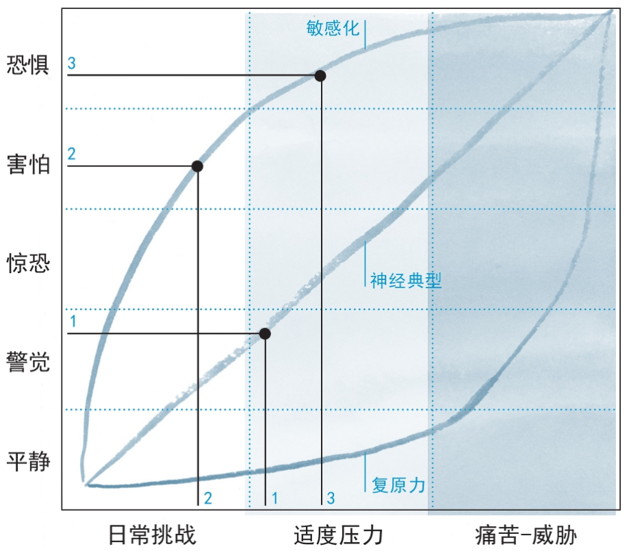
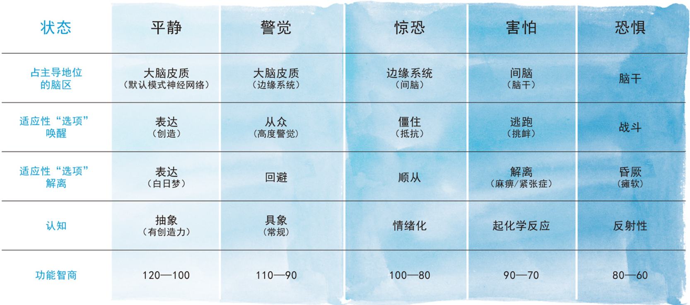

- ### 应激模式的发育
	- 挑战和压力会让我们偏离平衡状态。这时我们的内部应激反应就会被激活，让我们恢复平衡
	- 复原力
	  background-color:: #978626
		- 以适度的、可预见的、可控制的模式激活我们的应激反应系统，可以产生更为灵活、强大的应激反应能力（见图），让一个人在面对更加极端的压力源时也能表现出复原力。
	- 敏感化
	  background-color:: #264c9b
		- 不可预见的压力是持续的，痛苦、威胁和恐惧都是不可控状态，有时候还会变得极端。他的应激反应系统为了适应环境而变得敏感。于是杰西被永远困在了害怕的状态里。
	- 有三种发展逆境可以明确改变核心调节网络，广泛引发多种问题。
		- 第一种是出生前的破坏，比如母亲在孕期接触毒品、酒精或者极度痛苦（比如遭受家庭暴力）；
		- **第二种是婴儿早期与照顾者互动时的破坏，如果照顾者对待婴儿的方式是漫不经心的、不稳定的、粗暴的、具有侵略性的，或者是冷漠的，婴儿的应激反应系统就会以不正常的方式发育；**
		- 第三种是所有致敏性的应激模式
		  id:: 630164f2-ec6f-4512-a228-2be17e4ebdf9
	- {:height 527, :width 511}
	-
- ### 典型应激反应
	- 唤醒反应
	- 解离反应
	- {:height 270, :width 534}